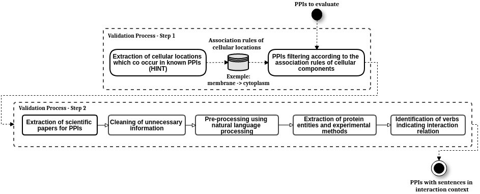

# PPI Validation Process

Python pipelines to filter positive predicted protein interactions according to two criteria: (i) association rules of cellular components according to gold standard PPI data from [HINT](http://hint.yulab.org/) and (ii) text mining on scientific papers published on [Pubmed](http://pubmed.ncbi.nlm.nih.gov/) extracting sentences where the proteins in the PPIs appeared in an interaction context

## Summary

The validation process proposed has two pipelines for filtering PPIs predicted by some _IN SILICO_  detection method, both pipelines can be executed separately. The first pipeline (i) filter according to association rules of cellular locations extracted from HINT database. The second pipeline (ii) filter according to scientific papers where both proteins in the PPIs appear in interaction context in the sentences.

The pipeline (i) starts extracting cellular component annotations from HINT PPIs building a dataset and then the Apriori algorithm is applied in this dataset in an iterative process that repeat the application of this algorithm till the rules cover 15 main locations in the cell. This process generate a database with association rules with two main columns: antecedent and consequent, meaning that a location that occurs in antecedent also occurs with the location in consequent. The filtering task evaluate the PPI checking if some location annotated for the first protein is in the antecedent column and if some location of the second protein is also in the same rule but in the consequent column. If so, the PPI passes according to the criteria.

The pipeline (ii) starts getting all papers that mention both proteins in the PPIs and extrating their content using the NCBI [API](https://www.ncbi.nlm.nih.gov/home/develop/api/). These XML files are cleaned removing hypertext markup and references to figures, tables and supplementary materials. The paragraphs of the remaining articles content are processed by Natural language processing steps to extract sentences, tokens, stopwords removal to remove words extremely common in english language and do not help to identify the context of interest, prioritizing tokens using part-of-speech tagging to keep just nouns and verbs. Then the sentences filtered goes to the task that identifies the proteins of the PPI in evaluation among the tokens and also tries to identify tokens or set of tokens that mention experimental methods. The sentences that have the proteins of interest are filtered if the nouns and verbs have some of the items of the list of words indicating interaction relation (recruit, bind, interact, signaling, etc). Finally, a report is made by pair with the article identifiers, the sentences, the proteins and interacting words found.

The figure below illustrates all the tasks of these pipelines.

<div style="text-align: center">
	
</div>

## Requirements:
* Python packages needed:
	- pip3 install pandas
	- pip3 install rdflib
	- pip3 install mlxtend
	- pip3 install inflect
	- pip3 install nltk
	- pip3 install biopython
	- pip3 install lxml
	- pip3 install bs4 (beautiful soup)

## Usage Instructions
### Preparation:
1. ````git clone https://github.com/YasCoMa/ppi_validation_process.git````
2. ````cd ppi_validation_process````

### Filtering by association rules of cellular locations (first filtering part) - File ````pipe_location_assocRules/find_pattern.py```` :
* Pipeline parameters:
	- __-fo__ or __--folder__ <br>
		Folder to store the files (use the folder where the other required file can be found)
	- __-if__ or __--interactome_file__ <br>
		File with the pairs (two columns with uniprot identifiers in tsv format)<br>

		Example of this file: pipe_location_assocRules/running_example/all_pairs.tsv


* Running modes examples:
	1. Go to the first filtering part folder: <br>
	````cd pipe_location_assocRules/````

	2. Uncompress annotation_data.zip
	
	3. Run: <br>
	````python3 find_pattern.py -fo running_example/ -if all_pairs.tsv````


### Filtering by text mining on scientific papers (second filtering part) - File ````ppi_pubminer/pubmed_pmc_literature_pipeline.py````:

* Pipeline parameters:
	- __-em__ or __--execution_mode__ <br>
		Use to indicate the execution mode desired: <br>
		1 - Mode using a list of protein pairs as bait <br>
		2 - Mode that tries to find sentences of PPI context for any protein pairs given a list of articles
	
	- __-fo__ or __--folder__ <br>
		Folder to store the files (use the folder where the other required file can be found)

	- __-rtm1__ or __--running_type_mode_1__ <br>
		Use to indicate which execution step you want to run for mode 1 (it is desirable following the order showed): <br>
		0 (default) - Run all steps <br>
		1 - Run step 1 (Get mentions of both proteins in PMC articles) <br>
		2 - Run step 2 (Get the PMC or Pubmed files, clean and store them) <br>
		3 - Run step 3 (Get the exact sentences where the proteins were found on interacting context)

	- __-rtm2__ or __--running_type_mode_2__ <br>
		Use to indicate which execution step you want to run for mode 2 (it is desirable following the order showed): <br>
		0 (default) - Run all steps <br>
		1 - Run step 1 (Get the PMC or Pubmed files from the given list, clean and store them) <br>
		2 - Run step 2 (Get the exact sentences where the proteins were found on an interacting context)

	- __-fp__ or __--file_pairs__ <br>
		(For mode 1) File with the pairs (two columns with uniprot identifiers in tsv format)<br>
		
		Example of this file: ppipubminer/running_example/mode_1/all_pairs.tsv

	- __-fe__ or __--file_evaluation__ <br>
		(For mode 1) File exported after step 1 execution in tsv format<br>

	- __-fa__ or __--file_articles__ <br>
		(For mode 2) File with the articles (First column indicating if it is from pmc or pubmed and the second one is the article id) in tsv format)<br>
		
		Example of this file: ppipubminer/running_example/mode_2/articles_info.tsv

* Running modes examples:
	- Go to the second filtering part folder: <br>
	````cd ppipubminer/````

	- Mode 1 - From protein pairs (PPIs) to sentences in articles
		1. Running all three steps of mode 1: <br>
		````python3 pubmed_pmc_literature_pipeline.py -em 1 -rtm1 0 -fo running_example/mode_1/ -fp all_pairs.tsv````

		2. Running only step 1 of mode 1: <br>
		````python3 pubmed_pmc_literature_pipeline.py -em 1 -rtm1 1 -fo running_example/mode_1/ -fp all_pairs.tsv````

		3. Running only step 2 of mode 1: <br>
		````python3 pubmed_pmc_literature_pipeline.py -em 1 -rtm1 2 -fo running_example/mode_1/ -fp all_pairs.tsv -fe literature_evaluation_pairs.tsv````

		4. Running only step 3 of mode 1: <br>
		````python3 pubmed_pmc_literature_pipeline.py -em 1 -rtm1 3 -fo running_example/mode_1/ -fp all_pairs.tsv -fe literature_evaluation_pairs.tsv````

	- Mode 2 - From articles to report of sentences with any protein pairs (PPIs)
		1. Running all three steps of mode 2: <br>
		````python3 pubmed_pmc_literature_pipeline.py -em 2 -rtm1 0 -fo running_example/mode_2/ -fa articles_info.tsv````

		2. Running only step 1 of mode 2: <br>
		````python3 pubmed_pmc_literature_pipeline.py -em 2 -rtm1 1 -fo running_example/mode_2/ -fa articles_info.tsv````

		3. Running only step 2 of mode 2: <br>
		````python3 pubmed_pmc_literature_pipeline.py -em 2 -rtm1 2 -fo running_example/mode_2/ -fa articles_info.tsv ````

## Reference
Martins YC, Ziviani A, Nicolás MF, de Vasconcelos AT. Large-Scale Protein Interactions Prediction by Multiple Evidence Analysis Associated With an In-Silico Curation Strategy. Frontiers in Bioinformatics. 2021:38.
https://www.frontiersin.org/articles/10.3389/fbinf.2021.731345/full

## Bug Report
Please, use the [Issues](https://github.com/YasCoMa/ppi_validation_process/issues) tab to report any bug.
